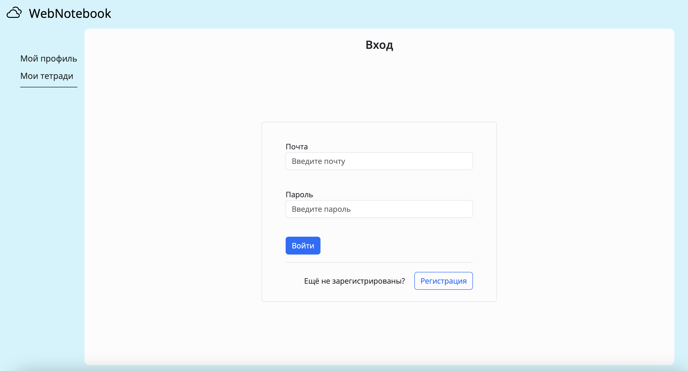
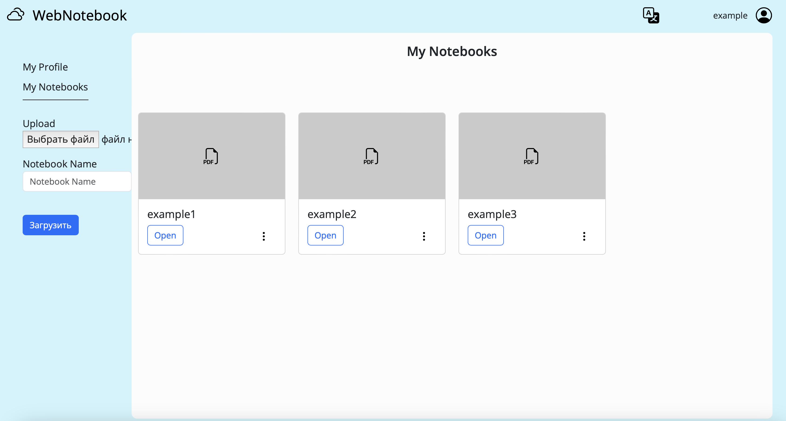

.. WebNotebook documentation master file, created by
   sphinx-quickstart on Tue Jun 13 01:18:29 2023.
   You can adapt this file completely to your liking, but it should at least
   contain the root `toctree` directive.

Welcome to WebNotebook's documentation!
=======================================

WebNotebook - это веб-приложение написанное на языке Python, с использованием фреймворка Flask. Оно позволяет студентам хранить свои конспекты лекций и семинаров в виде сканов, преобразованных в формат pdf.

.. toctree::
   :maxdepth: 1
   :caption: Contents:

   modules

Indices and tables
==================

* :ref:`genindex`
* :ref:`modindex`
* :ref:`search`
